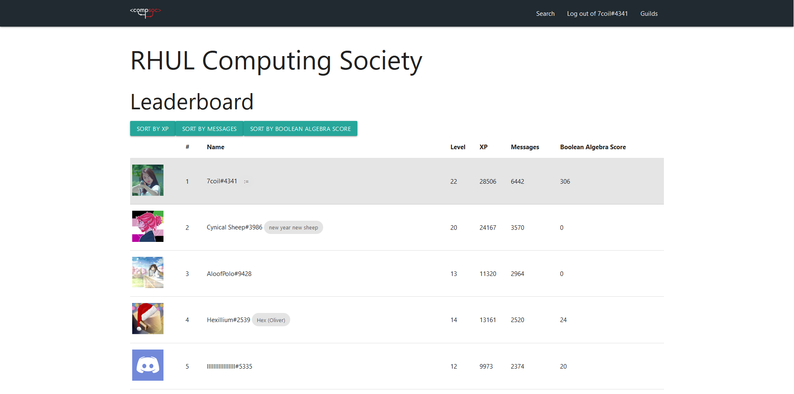

# passport-client

The CompSoc Passport is a service for communicating with backend services hosted and/or owned by the Computing Society.

The project has been rewritten with GraphQL in mind.
For the older version, see the `1.0` branch.

## Images

## Contributing

- Please ensure you have run `yarn format` before pushing new code.
